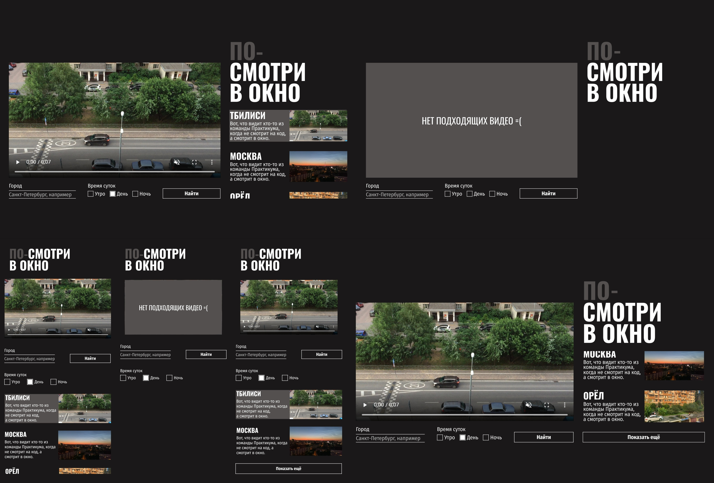

# Look-Out-the-Window

A pure HTML/CSS/JS project that lets you watch real-life window views from different cities and times of day. Just pick a location and enjoy the view.

**🔗 [Live Demo on GitHub Pages](https://frogush.github.io/look-Out-the-Window/)**  
**🎨 [Design in Figma](https://www.figma.com/design/R71mobRMR438r1p0eD0mlw/HTML-CSS-2?node-id=0-1&t=yxXOLxmbv1TeDtOU-1)**

## Preview



## 🇬🇧 English Version

Scroll down for the Russian version of the project description — ⬇️

## 📋 Project Description

The project is a web interface for viewing live window views from different cities and times of day. Users can select a city and time of day, after which corresponding video cards are displayed with filtering and playback of the selected video. The layout is responsive — initially designed for mobile and desktop versions in Figma, but also displays correctly on tablets and TVs.

The project has been checked using the **Pixel Perfect** utility and has a high percentage of match with the design mockup.

## 🧩 Technology Stack

* **HTML5** — semantic and valid markup
* **CSS3** (Grid, Flexbox, media queries) — responsive design
* **JavaScript (ES6+)** — dynamic loading, filtering, and video control
* **Stylelint** — CSS quality and standards checking
* **Prettier** — automatic code formatting

Additionally: **VS Code** with ready-made configuration for Stylelint and Prettier (`.vscode` folder). If you use a different editor, this folder can be deleted.

## 📁 Project Structure

```
├── fonts/              # Included fonts
├── images/             # Previews (other images are loaded from server)
├── scripts/            # JS project logic
│   └── index.js
├── styles/             # CSS files
│   ├── global.css
│   ├── style.css
│   ├── preloader.css
│   └── error.css
├── .vscode/            # Editor configuration (Stylelint + Prettier)
├── index.html          # Main HTML file
├── .stylelintrc.json   # Stylelint rules
├── .prettierrc         # Prettier settings
└── package.json        # Dependencies and scripts
```

> 📌 The `.vscode` folder is only needed if the developer uses VS Code — it contains preconfigured settings for Prettier and Stylelint extensions.

---

## 🚀 Launching the Project

1. Clone the repository:
```bash
git clone https://github.com/Frogush/look-Out-the-Window.git
cd look-Out-the-Window
```

2. Start the project:
- **Quick start**: open `index.html` in a browser
- **For development**: use Live Server in VS Code

3. (Optional) Install linters:
```bash
npm install
npx stylelint "**/*.css" --fix
npx prettier --write .
```

## 🧪 Scripts and Commands

The following commands can be used to run and check the project:

```bash
# Style checking
npx stylelint "**/*.{css,scss}"

# Auto-fixing styles
npx stylelint "**/*.{css,scss}" --fix

# Code formatting check
npx prettier . --check

# Code formatting
npx prettier . --write
```

> 📌 Formatting rules are specified below

## ⚙️ JavaScript Functions

| Function                          | Arguments                                                                 | Description                                                                                     |
|-----------------------------------|---------------------------------------------------------------------------|-------------------------------------------------------------------------------------------------|
| `mainMechanics(endpoint)`         | `endpoint` — request URL                                                  | Main function: loads data, renders cards/videos, handles errors and preloader                   |
| `showPreloader(tmp, parent)`      | `tmp` — template, `parent` — element                                      | Shows preloader in specified container                                                          |
| `removePreloader(parent, selector)` | `parent` — container, `selector` — preloader selector                    | Removes preloader from DOM                                                                      |
| `appendCards(params)`             | `params` — object with `{baseUrl, dataArray, cardTmp, container}`         | Renders and adds video cards to container                                                       |
| `setVideo(params)`                | `params` — object with `{baseUrl, video, videoUrl, posterUrl}`            | Sets video and poster in video element                                                          |
| `serializeFormData(form)`         | `form` — form                                                            | Collects and returns form data (city, selected time)                                            |
| `generateFilterRequest(endpoint, city, timeArray)` | `endpoint` — URL, `city` — city, `timeArray` — time array         | Creates filtered request URL by city and time of day                                            |
| `chooseCurrentVideo(params)`      | `params` — object with `{baseUrl, videoData, cardLinksSelector, currentLinkClassName, mainVideo}` | Adds event handlers to cards for video switching                                     |
| `showError(container, errorTemplate, errorMessage)` | `container` — container, `errorTemplate` — template, `errorMessage` — text | Shows error message                                                                             |
| `showMoreCards(params)`           | `params` — object with `{dataArray, buttonTemplate, cardsContainer, buttonSelector, initialEndpoint, baseUrl, cardTmp}` | Adds "Show more" button and loads additional cards |

## 🎨 Prettier Formatter Settings

| Rule                | Description                                                       |
| ------------------- | ----------------------------------------------------------------- |
| `printWidth: 100`   | Maximum line length — 100 characters                              |
| `tabWidth: 2`       | Indentation size — 2 spaces                                       |
| `useTabs: false`    | Use spaces instead of tabs                                        |
| `semi: true`        | Add semicolons at end of statements                               |
| `singleQuote: false`| Use double quotes                                                 |
| `trailingComma: es5`| Trailing commas in objects/arrays per ES5 standard                |
| `bracketSpacing: true` | Spaces inside curly braces (e.g., `{ a: 1 }`)                   |
| `arrowParens: avoid` | Omit parentheses around single parameter in arrow functions      |

## 🧼 Stylelint Configuration

| Rule                                             | Description                                                               |
| ----------------------------------------------- | ------------------------------------------------------------------------- |
| `color-no-invalid-hex`                          | Disallow invalid hex colors                                               |
| `value-keyword-case: lower`                     | Lowercase keyword values                                                  |
| `declaration-block-no-duplicate-properties`     | Disallow duplicate properties (except with different values)              |
| `declaration-block-no-shorthand-property-overrides` | Prevent shorthand property overrides                                  |
| `media-feature-name-no-unknown`                 | Disallow unknown media features                                           |
| `comment-no-empty`                              | Disallow empty comments                                                   |
| `no-descending-specificity`                     | Prevent specificity conflicts                                             |
| `no-duplicate-selectors`                        | Disallow duplicate selectors                                              |
| `no-invalid-position-at-import-rule`            | `@import` only allowed at beginning of file                               |
| `alpha-value-notation: number`                  | Alpha values must be numbers (not percentages)                            |
| `color-function-notation: modern`               | Use modern color function syntax                                          |
| `color-hex-length: short`                       | Use short hex notation (#fff instead of #ffffff)                          |
| `length-zero-no-unit: true`                     | Omit units for zero values (`0px` → `0`)                                  |
| `import-notation: url`                          | Imports must use `url()` syntax                                           |
| `shorthand-property-no-redundant-values`        | Disallow redundant values in shorthand properties                         |
| `declaration-block-single-line-max-declarations: 1` | Maximum 1 declaration per line                                        |
| `no-unknown-animations`                         | Disallow undefined animations                                             |
| `selector-type-case: lower`                     | Type selectors in lowercase                                               |
| `at-rule-empty-line-before: always`             | Require empty line before `@`-rules                                       |
| `selector-class-pattern: null`                  | Don't enforce class naming conventions                                    |
| `font-family-name-quotes: always-where-recommended` | Quotes around font names where recommended                           |

## 🇷🇺 Русская версия

## 📋 Описание проекта

Проект представляет собой веб-интерфейс для просмотра видео с живыми видами из окон разных городов и времён суток. Пользователь может выбрать город и время суток, после чего отображаются соответствующие видеокарточки с фильтрацией и воспроизведением выбранного видео. Макет адаптивный — изначально сделан под мобильную и десктопную версии в Figma, но при этом корректно отображается и на планшетах, и на телевизорах.

Проект проверен с помощью утилиты **Pixel Perfect** и обладает высоким процентом совпадения с макетом.

## 🧩 Стек технологий

* **HTML5** — семантическая и валидная разметка
* **CSS3** (Grid, Flexbox, медиазапросы) — адаптивный дизайн
* **JavaScript (ES6+)** — динамическая загрузка, фильтрация и управление видео
* **Stylelint** — проверка качества и стандартов CSS
* **Prettier** — автоматическое форматирование кода


Дополнительно: **VS Code** с готовой конфигурацией для Stylelint и Prettier (папка `.vscode`). Если вы используете другой редактор, то эту папку можно удалить.

## 📁 Структура проекта

```
├── fonts/              # Подключенные шрифты
├── images/             # Превью (остальное подгружается с сервера)
├── scripts/            # JS-логика проекта
│   └── index.js
├── styles/             # CSS-файлы проекта
│   ├── global.css
│   ├── style.css
│   ├── preloader.css
│   └── error.css
├── .vscode/            # Конфигурация редактора (Stylelint + Prettier)
├── index.html          # Главный HTML-файл
├── .stylelintrc.json   # Правила Stylelint
├── .prettierrc         # Настройки Prettier
└── package.json        # Зависимости и скрипты
```

> 📌 Папка `.vscode` нужна только если разработчик использует VS Code — там уже настроены параметры для работы расширений Prettier и Stylelint внутри редактора.

---

## 🚀 Запуск проекта

1. Клонировать репозиторий:
```bash
git clone https://github.com/Frogush/look-Out-the-Window.git
cd look-Out-the-Window
```

2. Запустить проект:
- **Быстрый старт**: открыть `index.html` в браузере
- **Для разработки**: использовать Live Server в VS Code

3. (Опционально) Установить линтеры:
```bash
npm install
npx stylelint "**/*.css" --fix
npx prettier --write .
```

## 🧪 Скрипты и команды

Для запуска и проверки проекта можно использовать следующие команды:

```bash
# Проверка стилей
npx stylelint "**/*.{css,scss}"

# Автоисправление стилей
npx stylelint "**/*.{css,scss}" --fix

# Проверка форматирования кода
npx prettier . --check

# Форматирование кода
npx prettier . --write
```

> 📌 Правила форматирования указаны ниже

## ⚙️ Функции JavaScript

| Функция                          | Аргументы                                                                 | Описание                                                                                     |
|-----------------------------------|---------------------------------------------------------------------------|---------------------------------------------------------------------------------------------|
| `mainMechanics(endpoint)`         | `endpoint` — URL запроса                                                  | Основная функция: загружает данные, рендерит карточки, видео, обрабатывает ошибки и прелоадер |
| `showPreloader(tmp, parent)`      | `tmp` — шаблон, `parent` — элемент                                        | Показывает прелоадер в указанном контейнере                                                  |
| `removePreloader(parent, selector)` | `parent` — контейнер, `selector` — селектор прелоадера                    | Убирает прелоадер из DOM                                                                     |
| `appendCards(params)`             | `params` — объект с `{baseUrl, dataArray, cardTmp, container}`            | Рендерит и добавляет карточки видео в контейнер                                              |
| `setVideo(params)`                | `params` — объект с `{baseUrl, video, videoUrl, posterUrl}`               | Устанавливает видео и постер в видеоэлемент                                                  |
| `serializeFormData(form)`         | `form` — форма                                                            | Собирает и возвращает данные формы (город, выбранное время)                                  |
| `generateFilterRequest(endpoint, city, timeArray)` | `endpoint` — URL, `city` — город, `timeArray` — массив времени         | Создаёт URL запроса с фильтрами по городу и времени суток                                    |
| `chooseCurrentVideo(params)`      | `params` — объект с `{baseUrl, videoData, cardLinksSelector, currentLinkClassName, mainVideo}` | Навешивает обработчики на карточки для переключения видео                          |
| `showError(container, errorTemplate, errorMessage)` | `container` — контейнер, `errorTemplate` — шаблон, `errorMessage` — текст | Показывает сообщение об ошибке                                                               |
| `showMoreCards(params)`           | `params` — объект с `{dataArray, buttonTemplate, cardsContainer, buttonSelector, initialEndpoint, baseUrl, cardTmp}` | Добавляет кнопку «Показать ещё» и подгружает карточки |

## 🎨 Настройки форматтера Prettier

| Правило                | Описание                                                       |
| ---------------------- | -------------------------------------------------------------- |
| `printWidth: 100`      | Максимальная длина строки — 100 символов                       |
| `tabWidth: 2`          | Размер отступа — 2 пробела                                     |
| `useTabs: false`       | Используются пробелы вместо табов                              |
| `semi: true`           | Ставить точку с запятой в конце каждого выражения              |
| `singleQuote: false`   | Использовать двойные кавычки                                   |
| `trailingComma: es5`   | В объектах и массивах по стандарту ES5 — запятая в конце       |
| `bracketSpacing: true` | Пробелы внутри фигурных скобок (например, `{ a: 1 }`)          |
| `arrowParens: avoid`   | Не ставить скобки вокруг одного параметра у стрелочных функций |

## 🧼 Настройки линтера стилей Stylelint

| Правило                                             | Описание                                                               |
| --------------------------------------------------- | ---------------------------------------------------------------------- |
| `color-no-invalid-hex`                              | Запрещает использовать невалидные HEX-цвета                            |
| `value-keyword-case: lower`                         | Ключевые слова в значениях пишутся строчными буквами                   |
| `declaration-block-no-duplicate-properties`         | Запрещает дублирование CSS-свойств, кроме случаев с разными значениями |
| `declaration-block-no-shorthand-property-overrides` | Предотвращает переопределение значений сокращённых свойств (шорткатов) |
| `media-feature-name-no-unknown`                     | Запрещает неизвестные медиа-фичи                                       |
| `comment-no-empty`                                  | Запрещает пустые комментарии                                           |
| `no-descending-specificity`                         | Предотвращает конфликты специфичности CSS                              |
| `no-duplicate-selectors`                            | Запрещает повторение одинаковых селекторов                             |
| `no-invalid-position-at-import-rule`                | `@import` разрешён только в начале файла                               |
| `alpha-value-notation: number`                      | Альфа-значения задаются только числами, не в процентах                 |
| `color-function-notation: modern`                   | Использовать современный синтаксис цветовых функций                    |
| `color-hex-length: short`                           | Использовать сокращённый HEX (#fff вместо #ffffff)                     |
| `length-zero-no-unit: true`                         | Не писать единицы измерения для нулевых значений (`0px` → `0`)         |
| `import-notation: url`                              | Импорты должны использовать синтаксис `url()`                          |
| `shorthand-property-no-redundant-values`            | Запрещает избыточные значения в сокращённых свойствах                  |
| `declaration-block-single-line-max-declarations: 1` | Максимум одно объявление на строку                                     |
| `no-unknown-animations`                             | Запрещает использование неопределённых анимаций                        |
| `selector-type-case: lower`                         | Типы селекторов в нижнем регистре                                      |
| `at-rule-empty-line-before: always`                 | Обязательный перенос строки перед `@`-правилами                        |
| `selector-class-pattern: null`                      | Не проверять стиль нейминга классов                                    |
| `font-family-name-quotes: always-where-recommended` | Кавычки вокруг имён шрифтов, когда это рекомендовано                   |